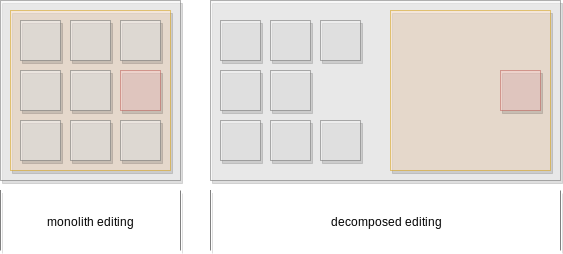
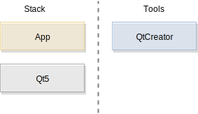
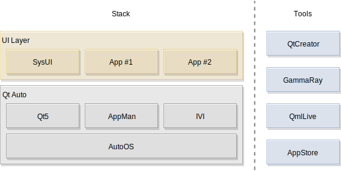
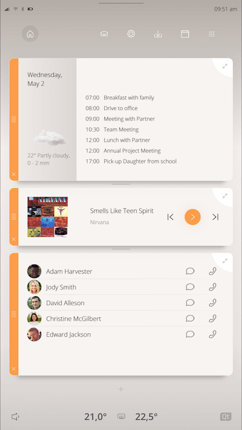

# What is QML Core UI

!!!info

    This material is work in progress and will change!

!!! abstract

    CoreUI was created out of the need for a more structured way of creating User Interfaces (UIs) not only for applications but also for large systems. The current process works fine if only a few people work on a small UI. But, as the user interface starts to get bigger and the number of people working on the UI layer increases, then the existing process is no longer well defined. It just doesn't scale. Ideally, CoreUI provides a pattern to scale UI development linearly without scrutinizing the implementation of UI features.

## Motivation

When observing Developers working on larger UIs, it is interesting to see the correlation between the development productivity and the UI complexity. Particularly, the development productivity drops as the UI complexity increases.

For example, Developers need to start the whole UI to navigate into a detailed view to fine-tune some UI logic or even animation. Often, this is because the UI can't be broken down into smaller, manageable chunks. In practical terms, it's about isolating a smaller portion of the UI and being able to work and validate this smaller portion. Breaking down the UI often happens on larger layers. But for UI development where the UI experience is an important factor, it's necessary to fine-tune small aspects of the UI to achieve the desired look and behavior. You have to aim for a fast (10ms) round trip time to make the conversation seamless between Design and Development.

You can easily avoid this situation with Qt and QML. While QML offers a great component model, it lacks a coherent approach to componentize the UI and to implement these UI components.

Looking at the current development approach it is clear that the UI's physical structure and the component types are created by following the UI specification and not from a technical perspective. For a developer, it's not clear when and how exactly to split a component into smaller parts, and to ensure a component is truly reusable as well as usable outside of its context.

TODO: Provide an example that shows a very simple UI and then displays the resulting code structure. For example a music player with controls. Consider using our old coding challenge for new developers.

CoreUI is an attempt to create an architecture and process to streamline this component creation task, similar to a component factory.

## What is CoreUI?

CoreUI is set of patterns and components to support a common user interface structure. It encourages both Developers and Designers to create a great user experience by focusing on the UI creation process. The CoreUI architecture stems from the creation and re-creation of user interface projects for various markets, especially the automotive one. After several re-creations of user interface projects for vertical markets, some patterns emerged. The CoreUI architecture as presented here is the distillation of these patterns.

CoreUI is an embedded development framework using Qt5 and the QML/JS language. Programming embedded software user interfaces can often be unnecessarily complicated. CoreUI makes the programming of these user interfaces easier, by making assumptions about what every developer needs to get started to create stunning user interfaces. It allows you to develop user interfaces by writing less code but accomplishing more. CoreUI aims to bring back the fun and creativity to user interface development so that Developers and Designers can focus on the user experience again.

CoreUI is based on the opinions of others. These opinions make assumptions about what is the best way to create user interfaces. CoreUI is meant to be used that way and discourages other ways. If you master CoreUI you'll probably experience a spike in productivity. If you keep up with your old habits and try to retrofit CoreUI with your old ways of working you may not reap CoreUI's full benefits.

## What CoreUI is not?

CoreUI is partly a concrete framework but it's not an exact path; more as a guideline. Often during a project, not all of the requirements are foreseeable and it's necessary to deviate from the path given.

CoreUI isn't an implementation of a user interface. It's also not designed for a single application, but covers a multi-application setup.

CoreUI is not final :-)

## CoreUI Stack

CoreuI is founded on top of Qt5 and QtAuto. Qt5 is the leading cross-platform native UI toolkit with an unprecedented focus on the user experience. It offers the developer all the necessary APIs to develop a truly native cross-platform application.

QtAuto extends Qt5, bringing multi-process application capabilities and a service framework to the table. By this, QtAuto is extending Qt into the space of creating multi-process user interfaces for mid and high-end embedded systems. Even if QtAuto targets primarily the automotive market, it's limited to this market.

CoreUI defines patterns and rules for the UI layer of a multi-process UI for embedded systems based on QtAuto. A reference implementation of CoreUI is the Neptune3 UI which is delivered together with QtAuto.

