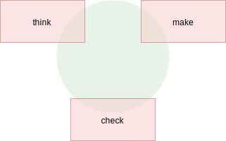

# Prototyping

!!!info

    This material is work in progress and will change!

User interface prototyping shall allow an early project to advance in the exploration of the user interface using a lean work flow. It is desirable but not always realistic that the resulting code shall follow the same architecture patterns and guides created for standard projects. Ideally, also the technology and used and the environment the technology is applied to shall be near a production. Making efforts to re-create a potential production environment ensures the outcome is somewhat comparable to a real scenario.

For embedded devices it important also get as close as possible to the target setup by using a similar or even less powerful board and a similar display and input methods. Also the housing can be prototyped to allow a user to experience the UI in a near real setup scenario.

## Introduction

What is the value of a user interface demonstrated on a high-end PC compared to the experience a user interface gives you in a comparable HW inside a setup comparable to the real HW where the user can explore the user interface? There needs always a balance between investment and revenue. If the revenue is high enough it is worthwhile going the extra mile to allow a potential user and stakeholders to experience the real device.



During prototyping, you want to focus on the UX less on system creation. You want to be agile and move fast. The turnaround time of a solution might be just hours or days and you focus less on testing or completeness or even correctness. You feel okay to fake data or behavior when needed and use the real data when suitable.

All of these decisions come with a cost, the prototyping software will never be your production software. The solution if carefully created might be used as a starting point for a product but seldom will evolve into a product. Often is is better and cheaper to start over again from the learning of the prototype code. Using a common architecture which is suited for prototyping and production increases the potential reuse and shortens time to market and the overall product creation costs.


!!! todo

	Show a diagram which shows a product platform being used for UI exploration by using and extending services and by using and extending the UI layer.


A carefully crafted production architecture should be flexible enough to be scaled from a prototyping phase into a production phase. It might require certain parts to be re-written as long as these parts are clearly marked and understood the effort and risk should be acceptable.

## Architecture

In an early prototyping architecture, you might want to skip the multi-process mode of AppMan as it removes the dependency to a Wayland setup. You still want to keep the SysUI/Application structure as it provides you a clean plan where to provide your QML components.

Services should be written using QML/JS and mock the behavior of a real service. A service with static data can be purely written using a QML file. If more dynamic data is require a JSON reader plug-in of HTTP requests API can be used to request more data, e.g. from JSON files or a JSON web service. Using JSON as the underlying mock-data format makes it easy to convert it into the QML/JS data types. Also MQTT can be easily used to provide mock-data and behavior or any.

An important aspect of the data source used it should be easily installable on different systems and the data must be easily create and changeable. Otherwise the idea of prototyping is not full-filled.


!!! todo

	Draw a diagram which showcases a production setup and a prototyping setup where the services are using other technologies but the client APIs are in QML.

```qml

// service/counter/Counter.qml

import http.requests 1.0

QtObject {
    id: root

    Requests {
        id: requests
        baseUrl: 'http://localhost:8888/api'
    }

    property var _state: ({
        count: 0
    })

    readonly property int count: _state.count

    void increment() {
        requests.post('increment', function(resp) {
            _state = resp.data;
        });
    }

    void decrement() {
        requests.post('decrement', function(resp) {
            _state = resp.data;
        });
    }
}
```

The code snippet above uses a JSON rest API provided on local host, which on every call will return the full state of that interface. This makes the coding of the state update much easier. Your prototyping implementation might look completely different. A good technology to use could be the JSON server from NodeJS (see https://github.com/typicode/json-server).

Ideally, the resulting QML API can be easily consumed by the UI or the Stores. The API should hide which technology was used and only export the data and operations of the client API. By this, we can later change the implementation using a different technology and keep the UI from being cluttered with IPC calls.

You would then use this mocked service client API as usual inside the RootStore.

```qml

// stores/RootStore.qml

import services.counter 1.0

QtObject {
    id: root

    Counter {
        id: counter
    }

    property alias count: counter.count

    function up() {
        if(count < 10) {
            counter.increment()
        }
    }

    function down() {
        if(count > 0) {
            counter.decrement()
        }
    }
}
```

This code snippet looks a little bit superficial as nothing really happens here, but in a more complex UI, a client and a store both carry different aspects of logic. It is a good practice to separate this aspect. A client to adopt an IPC conversation to a QML API and the Store to ensure the UI is clean of business logic.

## Reloading

As the client API is now a QML part we can enable live-reloading on this part. No need to compile source code or deploy libraries. If a NodeJS server is used it also supports already live-reloading using the nodemon tool, which means our whole chain would be live re-loadable, which is one of the cornerstones for Rapid-UI-Prototyping. Live-reload everything! Enjoy!


